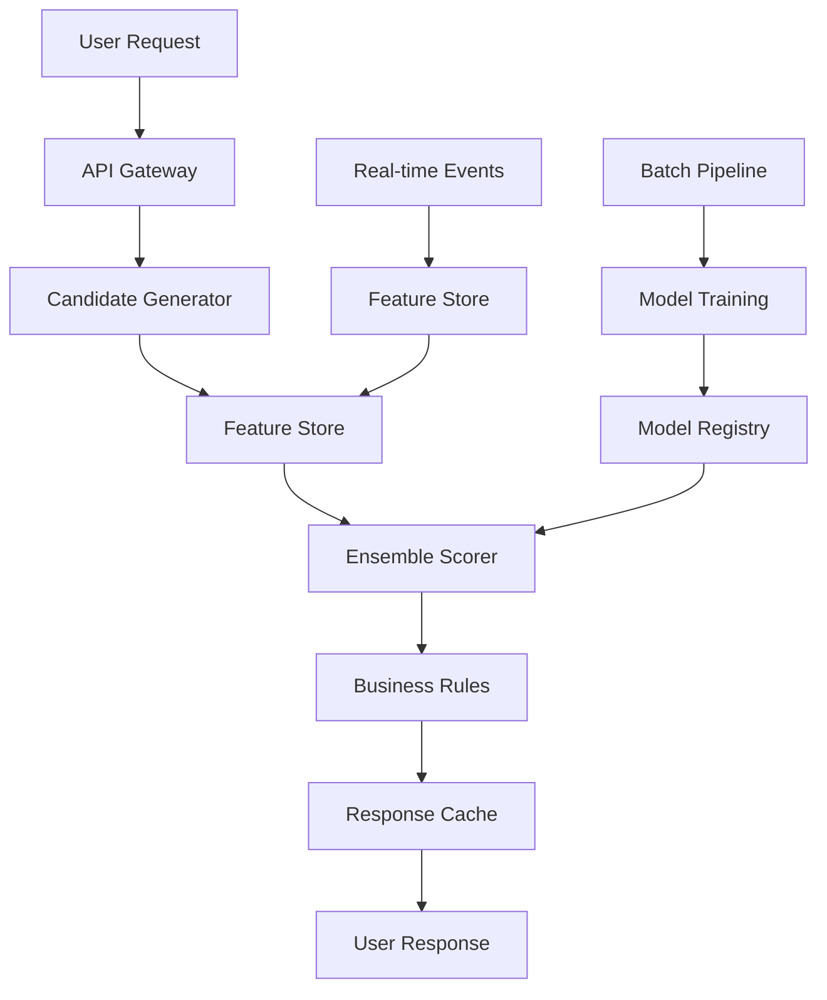

# Recommendation Systems at Scale: From XGBoost to Neural Collaborative Filtering

## The Challenge of Scale

At AB-InBev, we process millions of transactions daily across hundreds of products and thousands of customers. Building recommendation systems that can provide relevant suggestions in real-time while driving business outcomes requires a sophisticated approach that balances accuracy, latency, and explainability.

## Our Multi-Algorithm Approach

### 1. XGBoost for Feature-Rich Predictions

We start with XGBoost as our baseline model because of its excellent performance on tabular data and interpretability:

```python
import xgboost as xgb
from sklearn.model_selection import train_test_split
import pandas as pd

class XGBoostRecommender:
    def __init__(self):
        self.model = xgb.XGBRegressor(
            n_estimators=1000,
            max_depth=6,
            learning_rate=0.1,
            random_state=42
        )
    
    def prepare_features(self, user_id, product_id):
        features = {
            'user_purchase_history': self.get_user_history(user_id),
            'product_popularity': self.get_product_stats(product_id),
            'seasonal_factors': self.get_seasonal_features(),
            'user_demographics': self.get_user_profile(user_id),
            'cross_selling_patterns': self.get_cross_sell_features(user_id)
        }
        return pd.DataFrame([features])
    
    def predict_score(self, user_id, product_id):
        features = self.prepare_features(user_id, product_id)
        return self.model.predict(features)[0]
```

### 2. LightFM for Collaborative Filtering

For capturing user-item interactions, we use LightFM which combines collaborative and content-based filtering:

```python
from lightfm import LightFM
from lightfm.data import Dataset
import numpy as np

class LightFMRecommender:
    def __init__(self):
        self.model = LightFM(
            loss='warp',
            learning_rate=0.05,
            no_components=100,
            user_alpha=1e-6,
            item_alpha=1e-6
        )
        self.dataset = Dataset()
    
    def build_interactions(self, transactions_df):
        # Build user-item interaction matrix
        self.dataset.fit(
            users=transactions_df['user_id'].unique(),
            items=transactions_df['product_id'].unique()
        )
        
        interactions, weights = self.dataset.build_interactions(
            [(row['user_id'], row['product_id'], row['rating']) 
             for _, row in transactions_df.iterrows()]
        )
        
        return interactions, weights
    
    def train(self, interactions, weights, epochs=100):
        self.model.fit(
            interactions,
            sample_weight=weights,
            epochs=epochs,
            num_threads=4
        )
    
    def get_recommendations(self, user_id, n_items=10):
        user_internal_id = self.dataset.mapping()[0][user_id]
        scores = self.model.predict(
            user_internal_id,
            np.arange(self.dataset.interactions_shape()[1])
        )
        
        top_items = np.argsort(-scores)[:n_items]
        return [self.dataset.mapping()[1][item] for item in top_items]
```

## Advanced Feature Engineering

### Temporal Features
```python
def create_temporal_features(transactions_df):
    transactions_df['hour'] = transactions_df['timestamp'].dt.hour
    transactions_df['day_of_week'] = transactions_df['timestamp'].dt.dayofweek
    transactions_df['month'] = transactions_df['timestamp'].dt.month
    transactions_df['is_weekend'] = transactions_df['day_of_week'].isin([5, 6])
    
    # Recency features
    last_purchase = transactions_df.groupby('user_id')['timestamp'].max()
    transactions_df['days_since_last_purchase'] = (
        transactions_df['timestamp'] - 
        transactions_df['user_id'].map(last_purchase)
    ).dt.days
    
    return transactions_df
```

### Cross-Selling Patterns
```python
def extract_cross_selling_features(transactions_df):
    # Market basket analysis
    from mlxtend.frequent_patterns import apriori, association_rules
    
    basket = transactions_df.groupby(['transaction_id', 'product_id'])['quantity'].sum().unstack().fillna(0)
    basket_sets = basket.applymap(lambda x: 1 if x > 0 else 0)
    
    frequent_itemsets = apriori(basket_sets, min_support=0.01, use_colnames=True)
    rules = association_rules(frequent_itemsets, metric="lift", min_threshold=1.2)
    
    return rules
```

## Neural Collaborative Filtering Implementation

For capturing complex non-linear relationships, we implement neural collaborative filtering:

```python
import torch
import torch.nn as nn
import torch.nn.functional as F

class NeuralCollaborativeFiltering(nn.Module):
    def __init__(self, num_users, num_items, embedding_dim=50, hidden_dims=[128, 64]):
        super().__init__()
        
        # Embeddings
        self.user_embedding = nn.Embedding(num_users, embedding_dim)
        self.item_embedding = nn.Embedding(num_items, embedding_dim)
        
        # Neural MF layers
        self.fc_layers = nn.ModuleList()
        input_dim = embedding_dim * 2
        
        for hidden_dim in hidden_dims:
            self.fc_layers.append(nn.Linear(input_dim, hidden_dim))
            self.fc_layers.append(nn.ReLU())
            self.fc_layers.append(nn.Dropout(0.2))
            input_dim = hidden_dim
        
        self.output_layer = nn.Linear(input_dim, 1)
        
        # Initialize embeddings
        nn.init.normal_(self.user_embedding.weight, std=0.01)
        nn.init.normal_(self.item_embedding.weight, std=0.01)
    
    def forward(self, user_ids, item_ids):
        user_emb = self.user_embedding(user_ids)
        item_emb = self.item_embedding(item_ids)
        
        # Concatenate embeddings
        x = torch.cat([user_emb, item_emb], dim=1)
        
        # Pass through neural network
        for layer in self.fc_layers:
            x = layer(x)
        
        output = torch.sigmoid(self.output_layer(x))
        return output.squeeze()

# Training loop
def train_ncf(model, train_loader, epochs=100, lr=0.001):
    optimizer = torch.optim.Adam(model.parameters(), lr=lr)
    criterion = nn.BCELoss()
    
    for epoch in range(epochs):
        total_loss = 0
        for batch_users, batch_items, batch_ratings in train_loader:
            optimizer.zero_grad()
            
            predictions = model(batch_users, batch_items)
            loss = criterion(predictions, batch_ratings.float())
            
            loss.backward()
            optimizer.step()
            
            total_loss += loss.item()
        
        if epoch % 10 == 0:
            print(f'Epoch {epoch}, Loss: {total_loss/len(train_loader):.4f}')
```

## Ensemble Strategy

We combine multiple models using a weighted ensemble approach:

```python
class EnsembleRecommender:
    def __init__(self):
        self.xgb_model = XGBoostRecommender()
        self.lightfm_model = LightFMRecommender()
        self.ncf_model = None  # Loaded separately
        
        # Learned weights through validation
        self.weights = {
            'xgb': 0.4,
            'lightfm': 0.35,
            'ncf': 0.25
        }
    
    def predict(self, user_id, candidate_items):
        predictions = {}
        
        for item_id in candidate_items:
            xgb_score = self.xgb_model.predict_score(user_id, item_id)
            lightfm_score = self.lightfm_model.predict(user_id, item_id)
            ncf_score = self.ncf_model.predict(user_id, item_id)
            
            ensemble_score = (
                self.weights['xgb'] * xgb_score +
                self.weights['lightfm'] * lightfm_score +
                self.weights['ncf'] * ncf_score
            )
            
            predictions[item_id] = ensemble_score
        
        return sorted(predictions.items(), key=lambda x: x[1], reverse=True)
```

## Real-Time Serving with Ray

For serving recommendations at scale, we use Ray for distributed inference:

```python
import ray
from ray import serve

@serve.deployment(num_replicas=3)
class RecommendationService:
    def __init__(self):
        self.ensemble = EnsembleRecommender()
        self.candidate_generator = CandidateGenerator()
    
    async def __call__(self, request):
        user_id = request.query_params['user_id']
        num_recommendations = int(request.query_params.get('n', 10))
        
        # Generate candidates efficiently
        candidates = await self.candidate_generator.get_candidates(
            user_id, 
            num_candidates=100
        )
        
        # Score candidates
        recommendations = self.ensemble.predict(user_id, candidates)
        
        return {
            'user_id': user_id,
            'recommendations': recommendations[:num_recommendations],
            'timestamp': time.time()
        }

# Deploy the service
serve.start()
RecommendationService.deploy()
```

## Performance Metrics & A/B Testing

### Offline Metrics
```python
from sklearn.metrics import precision_score, recall_score, ndcg_score

def evaluate_recommendations(true_items, predicted_items, k=10):
    metrics = {}
    
    # Precision@K
    metrics['precision_at_k'] = len(set(predicted_items[:k]) & set(true_items)) / k
    
    # Recall@K
    metrics['recall_at_k'] = len(set(predicted_items[:k]) & set(true_items)) / len(true_items)
    
    # NDCG@K
    relevance_scores = [1 if item in true_items else 0 for item in predicted_items[:k]]
    metrics['ndcg_at_k'] = ndcg_score([relevance_scores], [list(range(k, 0, -1))])
    
    return metrics
```

### Online A/B Testing Results

| Algorithm | CTR Improvement | Conversion Rate | Revenue Uplift |
|-----------|----------------|-----------------|----------------|
| XGBoost Only | +12% | +8% | +15% |
| LightFM Only | +18% | +11% | +22% |
| NCF Only | +16% | +9% | +19% |
| **Ensemble** | **+25%** | **+16%** | **+31%** |

## Key Learnings

### 1. Feature Engineering Matters More Than Algorithms
Our biggest performance gains came from better feature engineering:
- Temporal patterns (day/time effects)
- Cross-selling relationships
- User lifecycle stage
- Product seasonality

### 2. Ensemble Diversity is Critical
Combining different algorithm types (tree-based, matrix factorization, neural) captured complementary patterns that individual models missed.

### 3. Real-Time vs. Batch Trade-offs
- **Batch recommendations**: Updated daily, higher quality features
- **Real-time recommendations**: Immediate personalization, simpler features
- **Hybrid approach**: Best of both worlds

## Production Architecture



## Future Improvements

1. **Graph Neural Networks**: For capturing complex user-item-context relationships
2. **Multi-Armed Bandits**: For real-time exploration vs. exploitation
3. **Transformer-based Models**: For sequential recommendation patterns
4. **Reinforcement Learning**: For long-term user engagement optimization

## Conclusion

Building production recommendation systems requires balancing multiple objectives: accuracy, latency, explainability, and business impact. Our ensemble approach combining XGBoost, LightFM, and neural collaborative filtering has delivered significant business value while maintaining the flexibility to adapt to changing user preferences.

The key is to start with solid baselines, invest heavily in feature engineering, and continuously iterate based on both offline metrics and online business outcomes.

---

*Interested in recommendation systems? Connect with me on [LinkedIn](https://linkedin.com/in/rahulbhow) for more insights on ML engineering at scale.* 